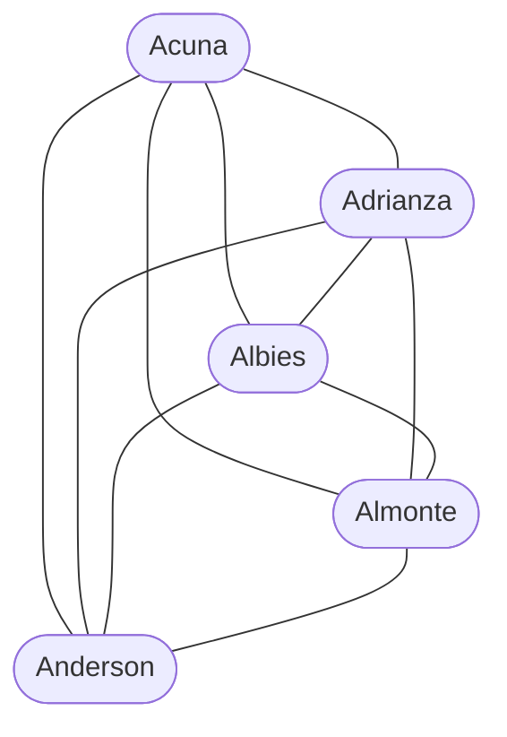
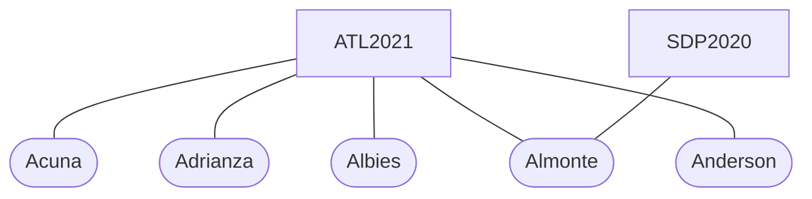

# MLBaconNumber
Charlie Morton was teammates with Tom Glavine who was teammates with Phil Niekro, so there are two degrees of connection from Charlie Morton to Phil Niekro. But what are the fewest degrees of connection required to reach the [first professional baseball game](https://www.retrosheet.org/1stGame.htm)?

This repository gives a definitive answer by searching a graph of MLB rosters for the shortest path. Cutting to the chase, the fewest degrees of connection for any active player (as of the 2022 season) is 7:

| Player | Late Career | Early Career |
| --- | --- | --- |
| Charlie Morton | 2022 Atlanta Braves | 2008 Atlanta Braves |
| Tom Glavine | 2008 Atlanta Braves | 1987 Atlanta Braves |
| Phil Niekro | 1987 Atlanta Braves | 1964 Milwaukee Braves |
| Warren Spahn | 1964 Milwaukee Braves | 1942 Boston Braves |
| Paul Waner | 1942 Boston Braves | 1926 Pittsburgh Pirates |
| Babe Adams | 1926 Pittsburgh Pirates | 1906 St. Louis Cardinals |
| Jake Beckley | 1906 St. Louis Cardinals | 1889 Pittsburgh Alleghenys |
| Deacon White | 1889 Pittsburgh Alleghenys | *Played in the 1st Game* |

This concept is the same as [Erdős numbers](https://en.wikipedia.org/wiki/Erd%C5%91s_number) and [Bacon numbers](https://en.wikipedia.org/wiki/Six_Degrees_of_Kevin_Bacon#Bacon_numbers), but since playing careers are much shorter than academic or acting careers, the "MLBacon number" of today's players are quickly increasing. As recently as 2008, the fewest degrees of connection was 7 (via Tom Glavine, who is listed above). By 2024 or 2025, the fewest degrees of connection will likely be 8. For a table of all players and their MLBacon number, see [data/bacon_numbers.csv](data/bacon_numbers.csv). The columns for bacon_numbers are:

| Column Name | Description |
| --- | --- |
| player_id | This id is defined by retrosheet.org. It is guaranteed to uniquely identify a player. |
| last_name | The player's last name |
| first_name | The player's first name |
| bacon_number | The player's bacon_number |
| max_year | The last year the player was in a professional league. |
| v0 | v0 stands for vertex 0. This is always the same as player_id. |
| e1 | e0 stands for edge 1. This is the team where the players in v0 and v1 played together. |
| v1 | v1 (vertex 1) is the next player in the chain (e.g., Tom Glavine). This is also their retrosheet id. |
| ... | *There are more vertex and edge columns that continue the chain to the first game.* |

Unfortunately, I haven't found a good way to search Retrosheets or Google for looking up a player, so the easiest method might be using excel to filter the MLBacon number CSV to find the player's first and last name.

The vertex and edge terms are because I built a graph of all players and their teammates to find the shortest path to the first game. If you are more interested in the graphs, see the "How it works" section.

## How it works (high-level)
### Example of input roster
The roster data is provided by the [Boxball](https://github.com/droher/boxball) repo. They have a CSV file containing
all teams and players for every year back to 1871. We will be using this to build our graph of teammates.
Here are 3 example rows for players from the 2021 Atlanta Braves:

| Year | Player Id | Last Name | First Name | Bats | Throws | Team Id | Position |
| --- | --- | --- | --- | --- | --- | --- | --- |
|2021|acunr001|Acuna|Ronald|R|R|ATL|OF|
|2021|adrie001|Adrianza|Ehire|B|R|ATL|2B|
|2021|albio001|Albies|Ozzie|B|R|ATL|2B|

Now that we know the players and their teams, our code can use the team and the year to find who played with whom.

### Building the graph
When I first tried to find my answer, I created a graph where I connected each player directly to their teammates.
Here, you can see what that would look like for 5 of the 2021 Braves:

This example graph is auto-generated and is laid out comically, at best. There are certainly simpler ways to draw the
graph, but the example helps illustrates the point how messy it gets when you use a graph like this. There are simply
*too many connections* to analyze the shortest path to the first game with a graph like this, and when I tried this in
my code, it was taking hours to complete.

A better way to create the graph is to only draw connections from a player to a team:

I included Almonte's 2020 team here to illustrate how this handles teams across different years. As you can tell
from the example, this includes significantly fewer edges, but we can still tell that Acuna and Albies played on the
same team since they are both connected to `ATL2021`.

### Running the shortest path algorithm. Example of output table.
Now that we have a working graph of all MLB players and their teammates, we can use a [built-in algorithm for finding
the shortest paths](https://en.wikipedia.org/wiki/Breadth-first_search#Applications) from every player to the first game.
I've hand-waved away some of the details, but after the algorithm runs, we get a table similar to:

| Id | Name | Distance to 1st Game |
| --- | --- | --- |
|acunr001|Ronald Acuna|16|
|adrie001|Ehire Adrianza|16|
|ATL2021|2021 Atlanta Braves|15|
|mortc002|Charlie Morton|14|

Since we redrew our graph to include connections from players to teams, our new table accounts for both,
unfortunately. Instead of Charlie Morton having a distance of 7, his distance is 14. The good news is that we can easily
fix this for our output table.

### Building the output table.
To get the final result, we can simply remove all the teams from the table & divide the distances by 2. Dividing by 2 accounts for
all the extra hops. In [data/bacon_numbers.csv](data/bacon_numbers.csv), I also included extra columns that list the Player Ids and
the Team Ids which make up the shortest path to the original game. I won't cover in detail how I did that here, but it mostly involved
a bunch of SQL JOINs.

## Acknowledgements
This idea has popped up a few time on the Baseball subreddit over the years, but the first time I saw it was
[this thread](https://old.reddit.com/r/baseball/comments/reqnzb/what_is_the_fewest_possible_number_of_players_it/).
Looking back, I'm impressed by the trivia knowledge. Multiple commenters were able to find examples of the shortes path.

In addition to the original Reddit thread, I have to thank the [Boxball](https://github.com/droher/boxball) repo. Having all the
data easily accessible was a life-saver.
